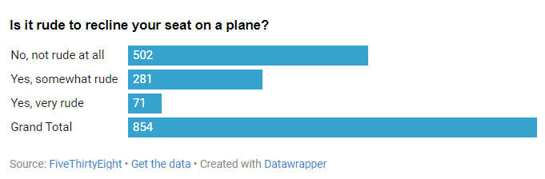

# Flying-Etiquette
I picked this question because it is one of the most common complaints I have about flying, so I was interested to see what proportion of respondents viewed reclining your seat as rude. Despite how often I hear about people being annoyed that the person in front of them reclined their seat, only about a third of respondents said they viewed it as rude or somewhat rude.

